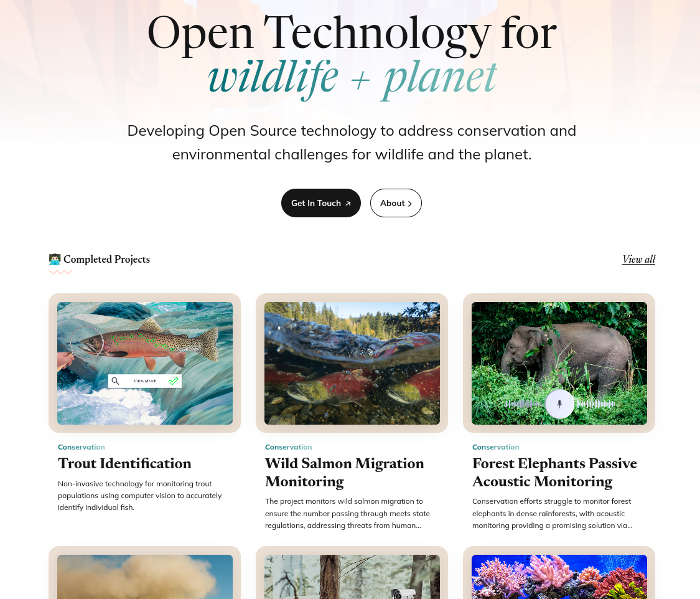

# EarthToolsMaker

Developing Open Source technology to address conservation and environmental
challenges for wildlife and the planet.

Welcome to EarthToolsMaker, a pioneering European-based organization
dedicated to leveraging and developing open-source technology for
global conservation efforts. At EarthToolsMaker, we are committed to
advancing the common good through innovative research and development
initiatives.

Collaboration and transparency are essential for achieving our shared
goal of preserving our planet's biodiversity. Through our dedication to
open-source principles, we aim to foster a culture of innovation and
cooperation that transcends borders and disciplines.

> Together, let's embark on a journey to better conserve, monitor, and
> protect our beautiful planet and to safeguard the
> natural world for future generations.
