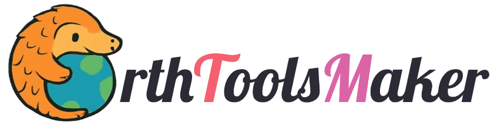

Conservation needs better technology. Most organizations can’t build it themselves.

We build it for them. Open-source machine learning tools for counting fish, detecting fires, identifying animals, and monitoring ecosystems. Free to use. Free to modify. Built with the people who use them.

> Better tools. Better data. Better outcomes.

- 🌎 Visit our [website](https://earthtoolsmaker.org)
- 📖 Read our [blog](https://www.earthtoolsmaker.org/posts/)
- 🧠 [Interact](https://www.earthtoolsmaker.org/spaces/) with our latest Machine Learning models
- 📬 [Contact us](https://www.earthtoolsmaker.org/contact/)
